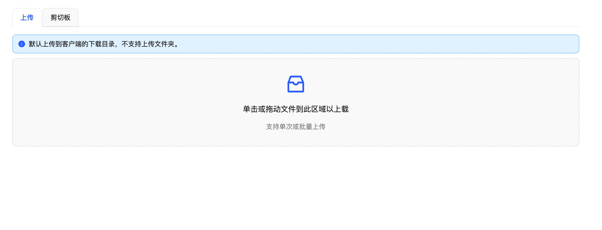
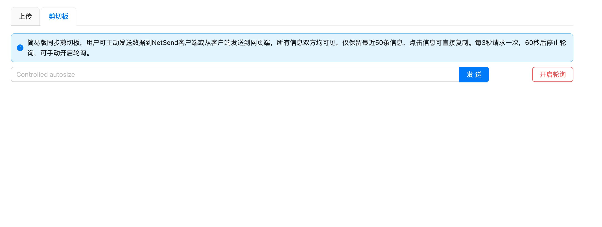

# NetSend


An intranet file transfer tool based on umijs + electron + javascript

## Introduction





### 更新说明

1. Added support for uploading files from client (non-NetSend App-installed device) to server (NetSend App-installed device) . The default storage location is the download directory.
2. New support for the client and server-side suggested text transfer tool, only support the last 50 text storage, information is multi-party visible, do not filter.
3. Added native IP functionality to display
4. Add interactionF


Support different systems to transfer files.
Transfer files between computers or mobile phones, no size limit.

## How to develop

### Project structure

```ssh
.
|-- build
|   |-- icon.icns                         // MacOS icon
|   |-- icon.ico                          // Windows icon
|   |-- webpack.base.config.js            // electron-webpack base config
|   |-- webpack.main.config.js            // electron-webpack dev config
|   `-- webpack.main.prod.config.js       // electron-webpack prod config
|-- dist                                  // build dist
|   |-- main                              // main dist
|   `-- renderer                          // render dist
|-- release                               // release folder
|-- src                                   // code folder
|   |-- main                              // main process code
|   |   -- main.js                        // main.js
|   |   -- koa.js                         // koa server
|   |   -- db.js                          // db
|   |   -- helper.js                      // public method
|   `-- renderer                          // umi code
|       |-- assets
|       |-- config
|       |   |-- config.js                 // umijs config
|       |-- pages
|           `-- index.js
|       |-- public
|           `-- renderer.js
|-- package.json
`-- README.md
```

#### Installation dependencies

```javascript
  $ npm i
```

#### Development

**nodejs version must <= 16.x.x**

1. start the rendering process

```javascript
  $ npm run start:renderer
```

2. start the main process

```javascript
  $ npm run start:main
```

#### build

```javascript
  $ npm run pack-mac  // build macOS
  $ npm run pack-exe   // build windows
```

If you want to package the code into a dmg file or zip file, you can execute the following command

```javascript
  $ npm run dist
```